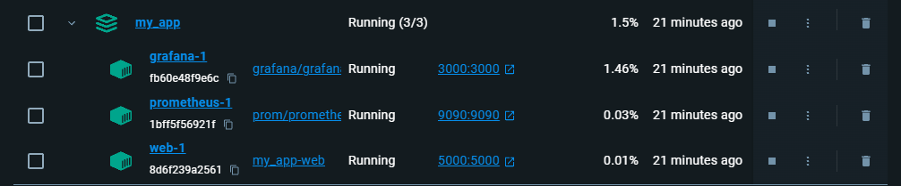
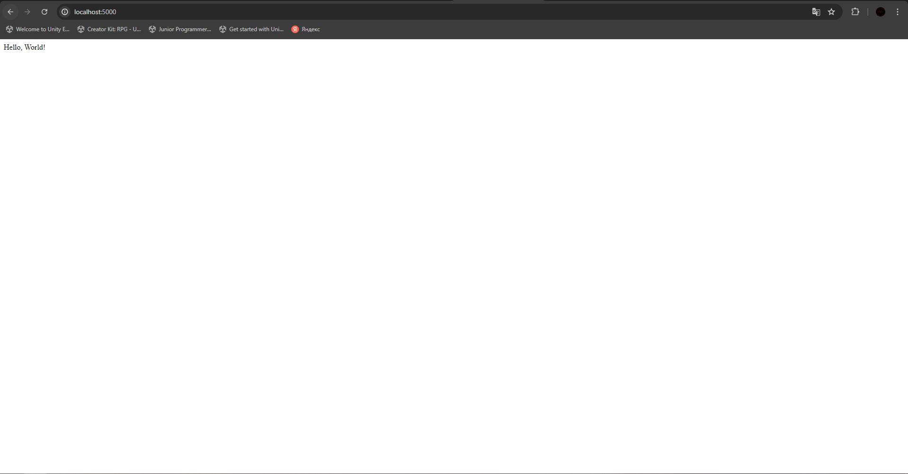
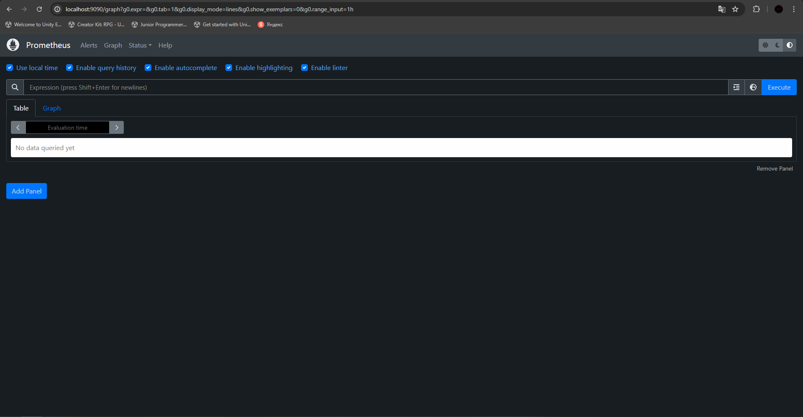
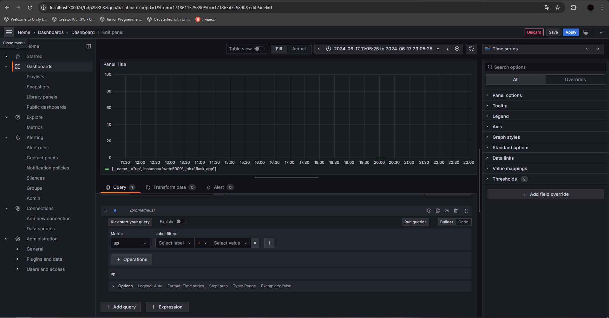
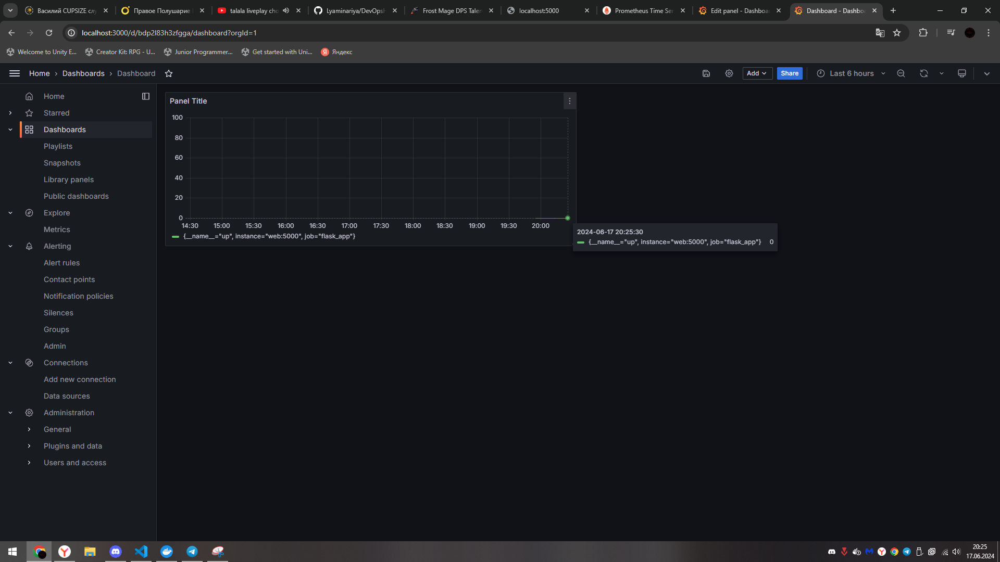
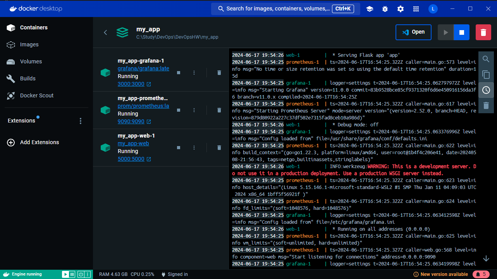
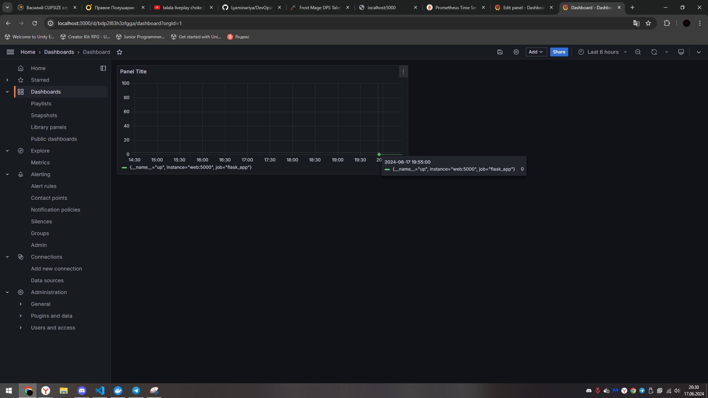

Данное приложение базируется на Grafana и Prometheus.

Для его запуска необходимо написать команду ./deploy.sh -t v1.0

Флаг -t опционален, он указывает версию Docker образа, по умолчанию latest.

После ввода команды запускаются контейнерыю

При переходе на http://localhost:5000/ мы видим рабочее веб-приложение.

Prometheus находится на http://localhost:9090/ и служит в качестве endpoint-а для сайта.

Сама Grafana находится на http://localhost:3000/ и используется для мониторинга сайта. В данном случае оно отображает время, когда веб-приложение запущено(up).

Скриншот самого Dashboard-а в 20:25, где видно, что Grafana в текущий момент времени действильно правильно отображает работу веб-приложения.

И для проверки того, что Grafana правильно отобразила время запуска веб-приложения привожу скрины со временем запуска контейнеров и скрин с инфой о начале работы веб-приложения.

